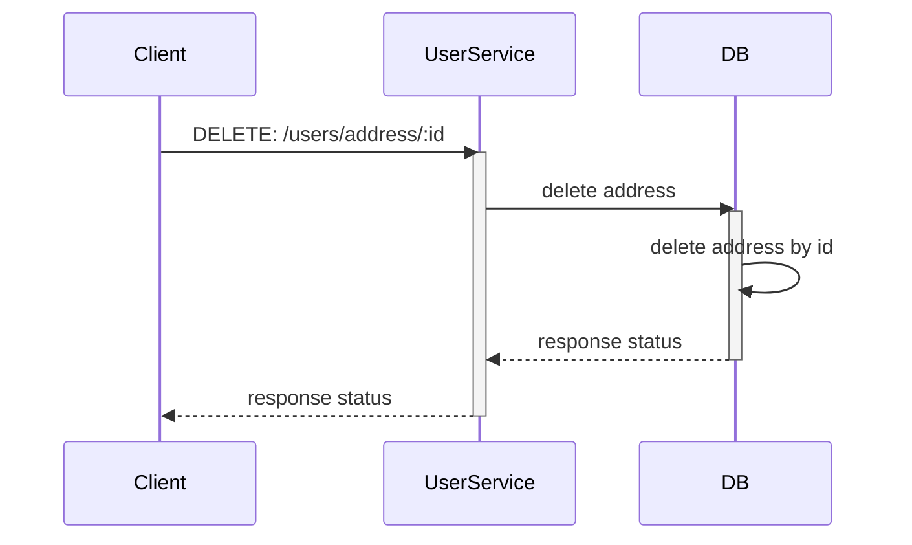

# delete address by id

```mermaid
sequenceDiagram
    Client->>UserService :  DELETE: /users/address/:id
    activate UserService
    UserService->>DB: delete address
    activate DB
    DB->>DB: delete address by id
    DB-->>UserService: response status
    deactivate DB
    UserService-->>Client: response status
    deactivate UserService
```
