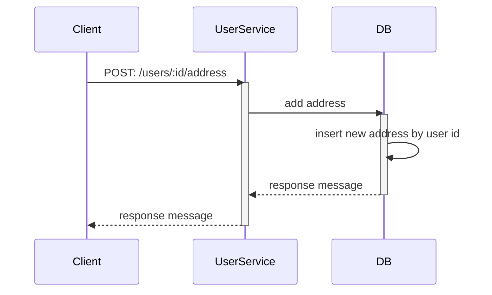

# add new address by user id

```mermaid
sequenceDiagram
    Client->>UserService :  POST: /users/:id/address
    activate UserService
    UserService->>DB: add address
    activate DB
    DB->>DB: insert new address by user id
    DB-->>UserService: response message
    deactivate DB
    UserService-->>Client: response message
    deactivate UserService
```
