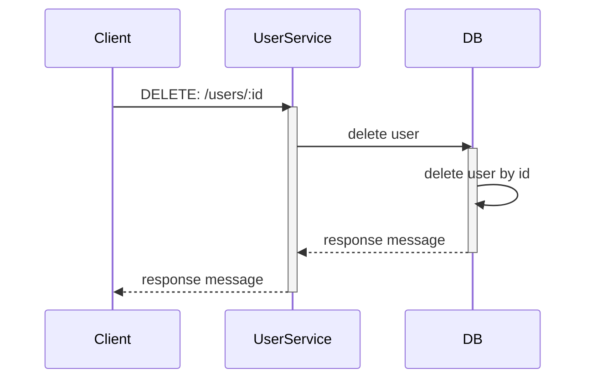

# delete user by id

```mermaid
sequenceDiagram
    Client->>UserService :  DELETE: /users/:id
    activate UserService
    UserService->>DB: delete user
    activate DB
    DB->>DB: delete user by id
    DB-->>UserService: response message
    deactivate DB
    UserService-->>Client: response message
    deactivate UserService
```
