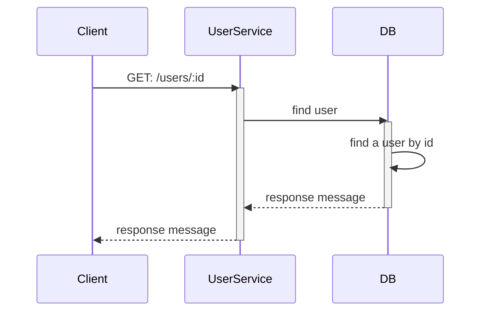

# get user by id

```mermaid
sequenceDiagram
    Client->>UserService :  GET: /users/:id
    activate UserService
    UserService->>DB: find user
    activate DB
    DB->>DB: find a user by id
    DB-->>UserService: response message
    deactivate DB
    UserService-->>Client: response message
    deactivate UserService
```
