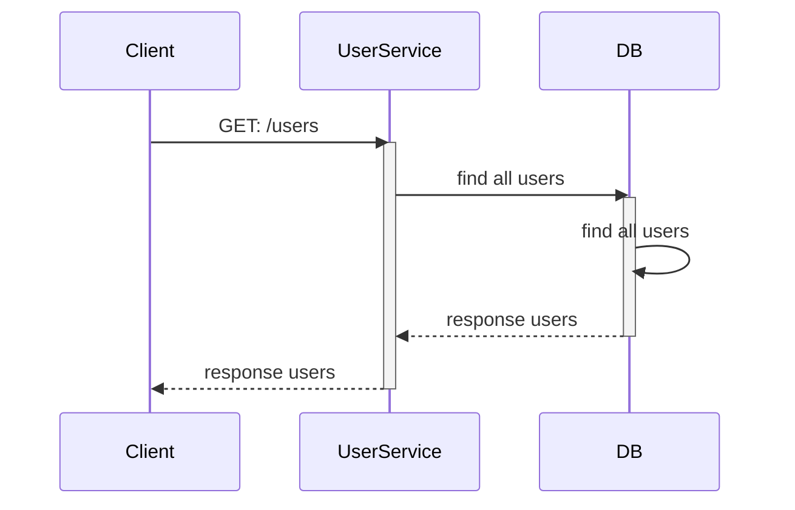

```mermaid
sequenceDiagram
    Client->>UserService :  GET: /users
    activate UserService
    UserService->>DB: find all users
    activate DB
    DB->>DB: find all users
    DB-->>UserService: response users
    deactivate DB
    UserService-->>Client: response users
    deactivate UserService
```
