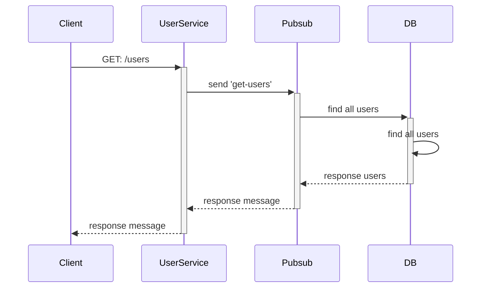

# get all users

```mermaid
sequenceDiagram
    Client->>+UserService :  GET: /users
    UserService->>+Pubsub : send 'get-users'
    Pubsub->>+DB : find all users
    DB->>DB: find all users
    DB-->>Pubsub: response users
    deactivate DB
    Pubsub-->>UserService: response message
    deactivate Pubsub
    UserService-->>Client: response message
    deactivate UserService
```
