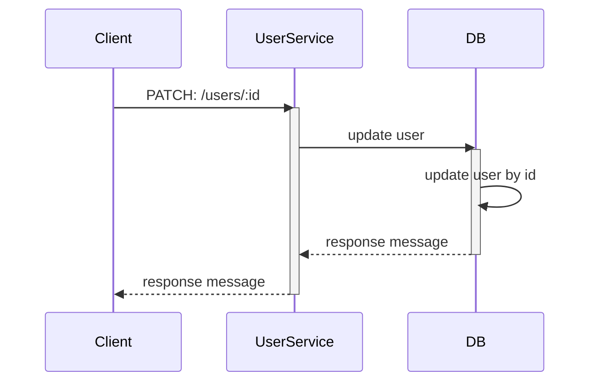

# update user by id

```mermaid
sequenceDiagram
    Client->>UserService :  PATCH: /users/:id
    activate UserService
    UserService->>DB: update user
    activate DB
    DB->>DB: update user by id
    DB-->>UserService: response message
    deactivate DB
    UserService-->>Client: response message
    deactivate UserService
```
