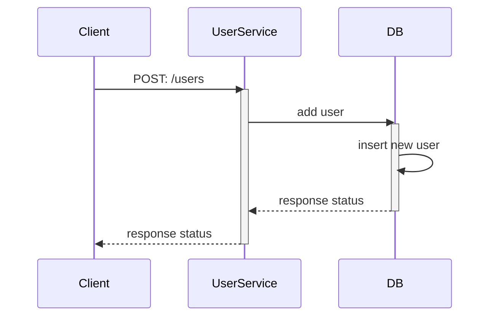

```mermaid
sequenceDiagram
    Client->>UserService :  POST: /users
    activate UserService
    UserService->>DB: add user
    activate DB
    DB->>DB: insert new user
    DB-->>UserService: response status
    deactivate DB
    UserService-->>Client: response status
    deactivate UserService
```
