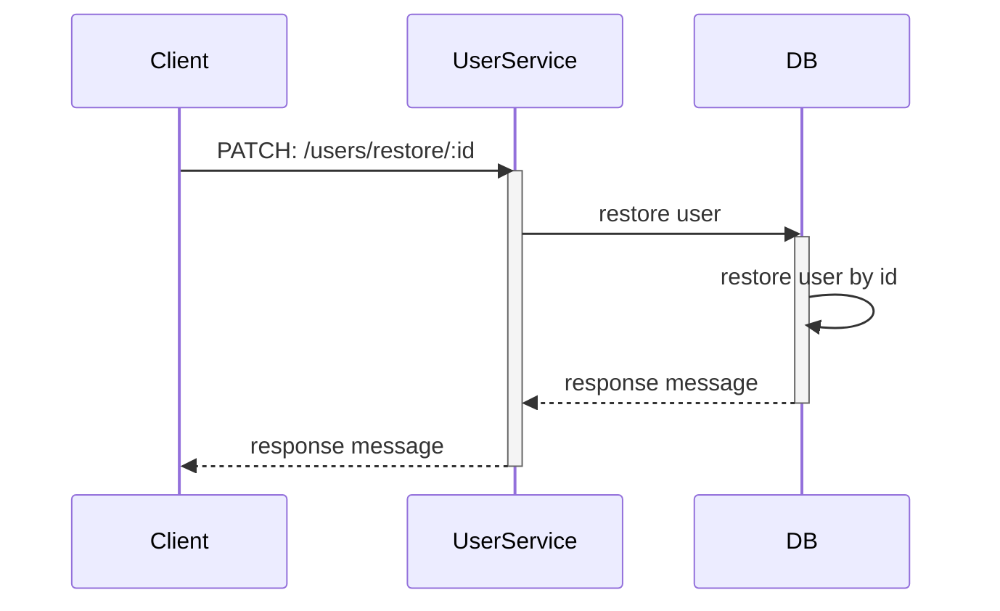

# restore user by id

```mermaid
sequenceDiagram
    Client->>UserService :  PATCH: /users/restore/:id
    activate UserService
    UserService->>DB: restore user
    activate DB
    DB->>DB: restore user by id
    DB-->>UserService: response message
    deactivate DB
    UserService-->>Client: response message
    deactivate UserService
```
